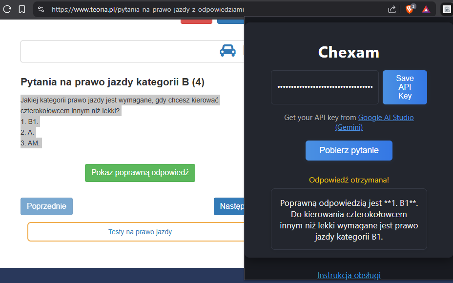

<p align="center">
  
</p>

<h1 align="center">Chexam</h1>

<p align="center">
  <b>Inteligentny asystent egzaminacyjny w Chrome z Gemini (Google AI Studio)</b><br>
  <i>Smart Chrome exam assistant powered by Gemini (Google AI Studio)</i>
</p>

<p align="center">
  <a href="#instrukcja-obsługi-polski">🇵🇱 Polski</a> • <a href="#user-guide-english">🇬🇧 English</a>
</p>

<p align="center">
  
</p>

---

## ✨ Opis / Description

**Chexam** to nowoczesne rozszerzenie do Chrome, które wykorzystuje model Gemini (Google AI Studio) do pomagania w rozwiązywaniu pytań egzaminacyjnych online. Wystarczy zaznaczyć pytanie na stronie, kliknąć przycisk w popupie i natychmiast otrzymasz odpowiedź!

**Chexam** is a modern Chrome extension that uses the Gemini model (Google AI Studio) to help you answer online exam questions. Just select a question on the page, click the button in the popup, and get an instant answer!

---

## 📸 Zrzut ekranu / Screenshot

<p align="center">
  
</p>

---

## 🇵🇱 Instrukcja obsługi (Polski)

### Jak korzystać?
1. Otwórz stronę z pytaniami egzaminacyjnymi lub innym tekstem, który chcesz przeanalizować.
2. Zaznacz myszką interesujące Cię pytanie lub fragment tekstu na stronie (tak jak zwykły tekst).
3. Kliknij ikonę rozszerzenia **Chexam** w pasku przeglądarki.
4. W oknie popup kliknij przycisk **Pobierz pytanie**.
5. Rozszerzenie pobierze zaznaczony tekst i wyśle go do Gemini (model gemini-1.5-flash-latest przez Google AI Studio).
6. Odpowiedź pojawi się w oknie popup oraz w konsoli popupu (F12).
7. Jeśli używasz rozszerzenia po raz pierwszy, wprowadź swój klucz Gemini API w odpowiednim polu popupu.
8. Rozszerzenie działa tylko na zwykłych stronach internetowych (nie na chrome:// itp.).

### Wymagania
- Przeglądarka Google Chrome
- Klucz API z [Google AI Studio (Gemini)](https://aistudio.google.com/app/apikey)

### Instalacja
1. Pobierz repozytorium lub sklonuj je:
   ```bash
   git clone https://github.com/Matus4709/Chexam.git
   ```
2. Otwórz `chrome://extensions` w Chrome.
3. Włącz tryb deweloperski (prawy górny róg).
4. Kliknij „Załaduj rozpakowane” i wskaż folder z projektem.
5. Gotowe!

---

## 🇬🇧 User Guide (English)

### How to use?
1. Open a page with exam questions or any text you want to analyze.
2. Select the question or text fragment with your mouse (as regular text).
3. Click the **Chexam** extension icon in the browser bar.
4. In the popup window, click the **Get Question** button.
5. The extension will grab the selected text and send it to Gemini (gemini-1.5-flash-latest model via Google AI Studio).
6. The answer will appear in the popup and in the popup console (F12).
7. If this is your first time, enter your Gemini API key in the popup field.
8. The extension works only on regular web pages (not on chrome:// etc.).

### Requirements
- Google Chrome browser
- API key from [Google AI Studio (Gemini)](https://aistudio.google.com/app/apikey)

### Installation
1. Download or clone the repository:
   ```bash
   git clone https://github.com/Matus4709/Chexam.git
   ```
2. Open `chrome://extensions` in Chrome.
3. Enable Developer Mode (top right corner).
4. Click "Load unpacked" and select the project folder.
5. Done!

---

## ❓ FAQ

### 🇵🇱 Najczęściej zadawane pytania

**1. Czy Chexam jest darmowy?**  
Tak, rozszerzenie jest darmowe, ale korzystanie z API Gemini może podlegać limitom Google AI Studio. Na start Google daje darmowe limity.

**2. Skąd wziąć klucz API?**  
Zarejestruj się na [Google AI Studio](https://aistudio.google.com/app/apikey) i wygeneruj klucz API.

**3. Czy moje dane są bezpieczne?**  
Tak, Twój klucz API jest przechowywany tylko lokalnie w przeglądarce.

**4. Nie działa zaznaczanie tekstu!**  
Upewnij się, że zaznaczasz tekst na zwykłej stronie internetowej, a nie w pliku PDF lub na stronie systemowej Chrome.

**5. Czy mogę używać innych modeli?**  
Tak, możesz zmienić model w pliku `background.js` na inny dostępny w Google AI Studio.

### 🇬🇧 Frequently Asked Questions

**1. Is Chexam free?**  
Yes, the extension is free, but using the Gemini API may be subject to Google AI Studio limits. Google provides free quotas for new users.

**2. Where do I get the API key?**  
Register at [Google AI Studio](https://aistudio.google.com/app/apikey) and generate your API key.

**3. Is my data safe?**  
Yes, your API key is stored only locally in your browser.

**4. Text selection does not work!**  
Make sure you are selecting text on a regular web page, not in a PDF or Chrome system page.

**5. Can I use other models?**  
Yes, you can change the model in `background.js` to any model available in Google AI Studio.

---

## 🛡️ Security Note

Twój klucz API Gemini jest przechowywany lokalnie w przeglądarce i używany tylko do komunikacji z Google AI Studio. Rozszerzenie nie wysyła klucza na żadne inne serwery.

Your Gemini API key is stored locally in your browser and is only used to make requests to Google AI Studio. The extension does not send your API key to any other servers.

---

## 📄 License

MIT License 